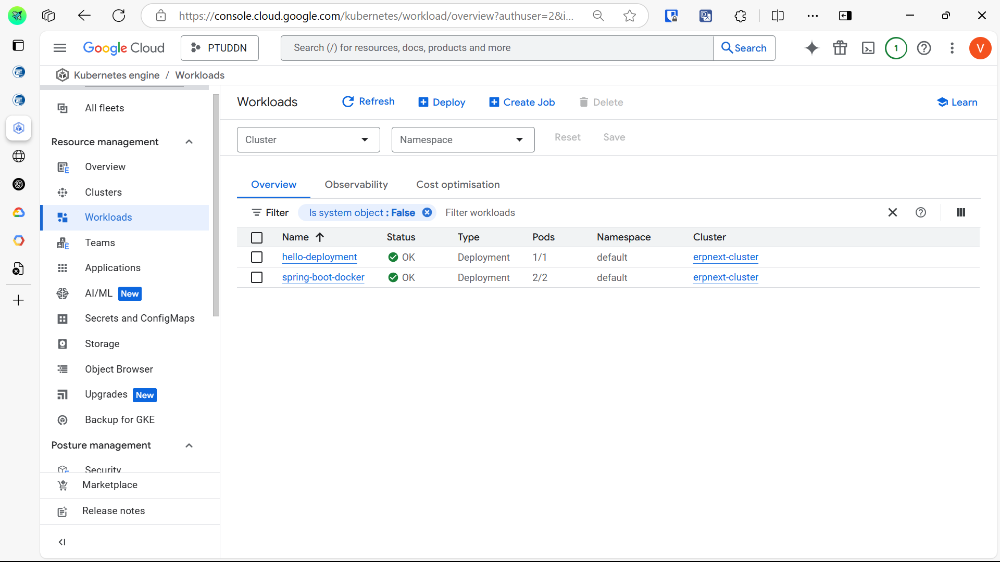
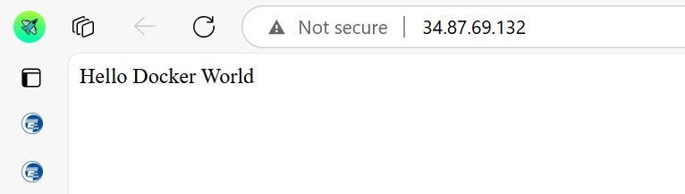
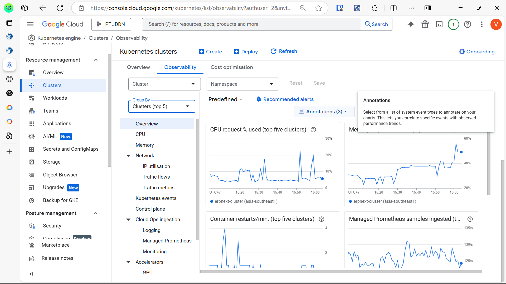
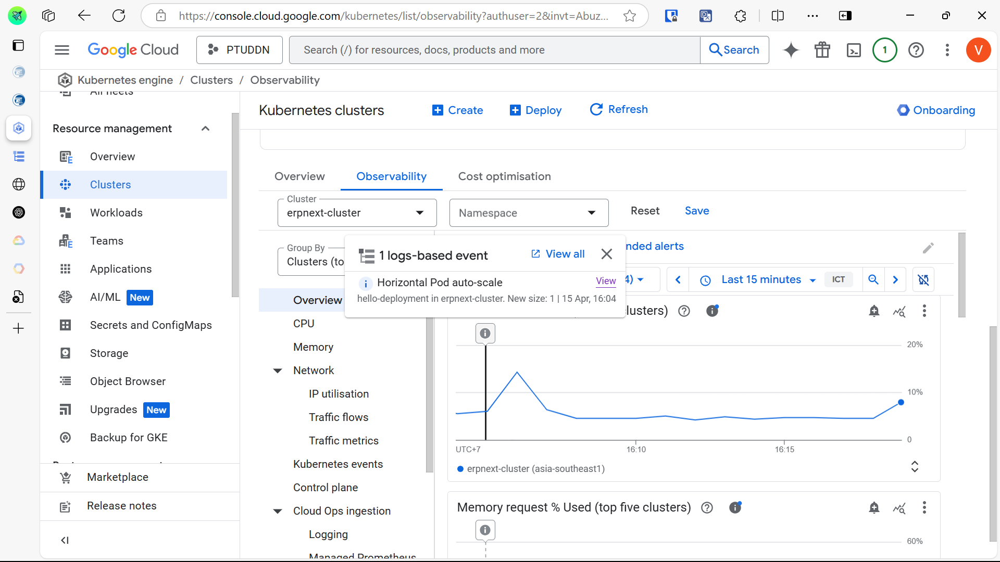

# GKE Deployment

Name: Trần Vỹ Anh (StudentID: 22024508)

## Overview
This section describes deploy and monitor the application on Google Kubernetes Engine.

## Key Features
- Containerize with Docker
- Manually deploy to GKE
- Config LoadBalancer for public access

## Screenshot

"spring-boot-docker" has successfully deployed on GKE

Access the application via external ip

Monitor directly on GCP Console

Tested with 5000 requests, system automatically increase 1 cpu